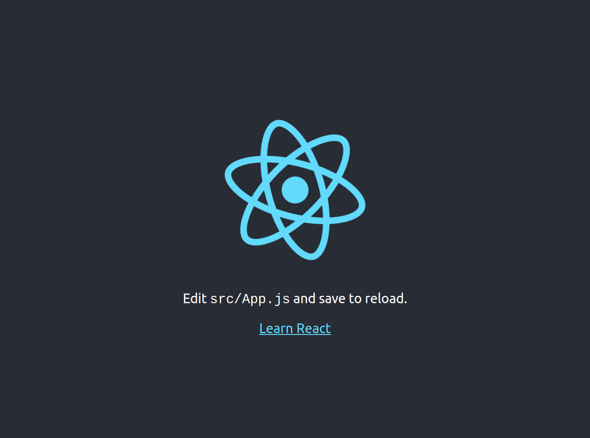

# React Calculator

> This project is intended to learn how to build a very simple react application. This project has been split into multiple
> milestones, and each milestone has its own technical requirements   

## Built With

- HTML, CSS, Javascript
- React,
- npm, big.js, prop-types heroku

## Live Demo

[Live Demo Link](https://react-calculator-mv.herokuapp.com/)

## Getting Started

**This is an example of how you may give instructions on setting up your project locally.**
**Modify this file to match your project, remove sections that don't apply. For example: delete the testing section if the currect project doesn't require testing.**

run the command `git clone git@github.com:oscardelalanza/react-calculator.git`

### Prerequisites
you must have `npm` or `yarn` installed in order to install `node_modules`

## Authors

👤 **Oscar De La Lanza**

- Github: [@oscardelalanza](https://github.com/oscardelalanza)
- Twitter: [@oscardelalanza](https://twitter.com/oscardelalanza)
- Linkedin: [Oscar De La Lanza](https://linkedin.com/in/oscardelalanza)
- Email: oscardelalanza@gmail.com

## 🤝 Contributing

Contributions, issues and feature requests are welcome!

## Show your support

Give a ⭐️ if you like this project!

## 📝 License

This project is [MIT](lic.url) licensed.

This project was bootstrapped with [Create React App](https://github.com/facebook/create-react-app).