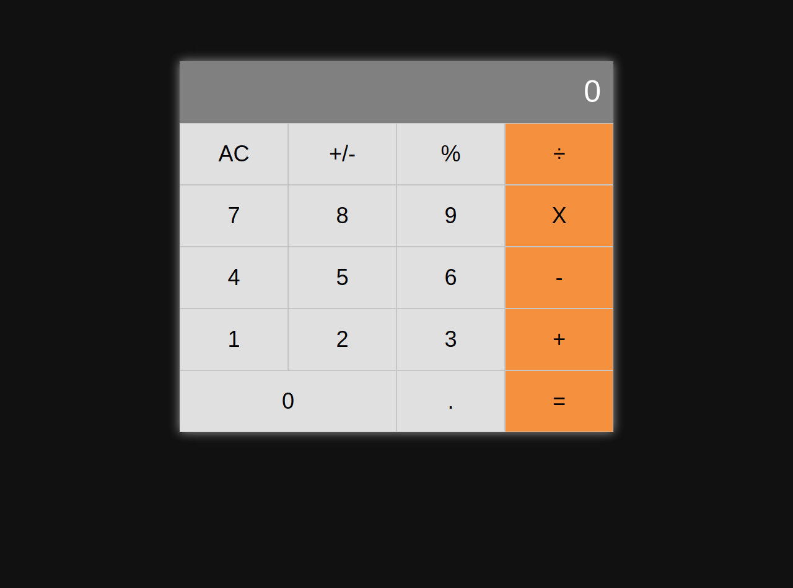
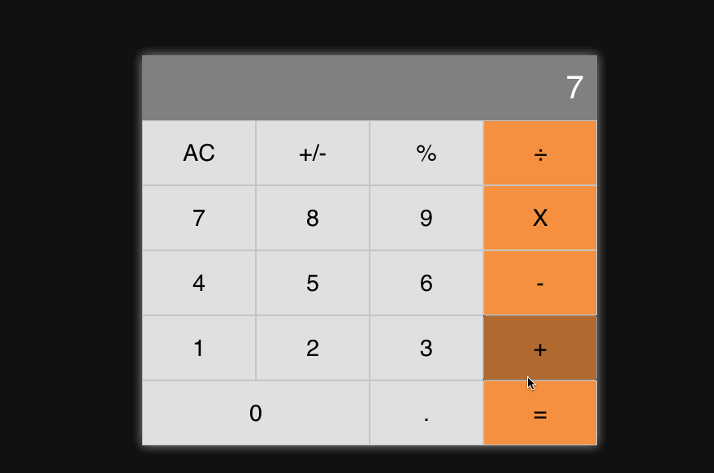

# React Calculator

> This project is intended to learn how to build a very simple react application. This project has been split into multiple
> milestones, and each milestone has its own technical requirements.   

You can find the original requirements [here](https://github.com/microverseinc/project-react-calculator)

## Built With

- HTML, CSS, Javascript, SASS
- React,
- npm, big.js, prop-types, Heroku

## Live Demo

[Live Demo Link](https://react-calculator-mv.herokuapp.com/)

## Getting Started

This is a very simple React application that consists of a fully working calculator app.

> To get a local copy up and running follow these simple example steps.

### Prerequisites

- `npm`
- `Git`

### Setup

To clone the project into your local environment do the following.

- Open a new `terminal` window and navigate to the directory where the project will be stored.
- Run the command `git clone git@github.com:oscardelalanza/react-calculator.git`.
- Run the command `cd react-calculator` to enter to the project directory.

### Install

To install the requires packages do the following.

- Inside `react-calculator` directory run the command `npm install`.

### Usage
 
- Use it as a normal `calculator`.

### Deployment

To start the local development server do the following.

- Run the command `npm start`.

To build the project do the following.

- Run the command `npm react-scripts build`.

## Authors

👤 **Oscar De La Lanza**

- Github: [@oscardelalanza](https://github.com/oscardelalanza)
- Twitter: [@oscardelalanza](https://twitter.com/oscardelalanza)
- Linkedin: [Oscar De La Lanza](https://linkedin.com/in/oscardelalanza)
- Email: oscardelalanza@gmail.com

## 🤝 Contributing

Contributions, issues and feature requests are welcome!

## Show your support

Give a ⭐️ if you like this project!

## 📝 License

This project is [MIT](lic.url) licensed.

This project was bootstrapped with [Create React App](https://github.com/facebook/create-react-app).
